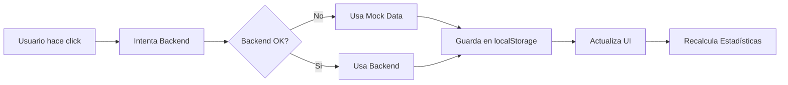

# 🔧 Guía para Probar el Sistema de Reseñas Mock

## ✅ **Estado Actual**

El sistema de reseñas ahora funciona completamente con datos mock locales. Los errores 404 son **NORMALES** ya que no hay backend real funcionando, pero el sistema tiene fallback completo a datos mock.

## 📊 **Datos Mock Disponibles**

### **6 Reseñas de Ejemplo:**
1. **María González** ⭐⭐⭐⭐⭐ (Aprobada)
2. **Carlos Rodríguez** ⭐⭐⭐⭐ (Aprobada)  
3. **Ana Martínez** ⭐⭐⭐⭐⭐ (Aprobada)
4. **Luis Herrera** ⭐⭐⭐⭐ (Pendiente) ⬅️ **USAR ESTA PARA PROBAR**
5. **Carmen Silva** ⭐⭐⭐⭐⭐ (Aprobada)
6. **Diego Fernández** ⭐⭐⭐ (Pendiente) ⬅️ **USAR ESTA PARA PROBAR**

### **Estadísticas Automáticas:**
- **Total**: 6 reseñas
- **Aprobadas**: 4
- **Pendientes**: 2
- **Promedio**: 4.5 ⭐

## 🧪 **Cómo Probar las Operaciones**

### **1. Verificar Carga de Datos**
```
✅ Ir a: http://localhost:5173/admin/reseñas
✅ Deberías ver: 6 reseñas cargadas
✅ Estadísticas: Total 6, Aprobadas 4, Pendientes 2
```

### **2. Probar Aprobación**
```
🎯 Buscar reseña de "Luis Herrera" (Estado: Pendiente)
👆 Hacer click en "Aprobar"
✅ Debe cambiar a "Aprobada" 
✅ Las estadísticas deben actualizarse automáticamente
```

### **3. Probar Rechazo** 
```
🎯 Buscar reseña de "Diego Fernández" (Estado: Pendiente)
👆 Hacer click en "Rechazar"  
✅ Debe cambiar a "Rechazada"
✅ Las estadísticas deben actualizarse
```

### **4. Verificar Persistencia**
```
🔄 Recargar la página (F5)
✅ Los cambios deben persistir (guardados en localStorage)
✅ Los estados de las reseñas se mantienen
```

## 🐛 **Errores Esperados (NORMALES)**

### **En la Consola verás:**
```javascript
❌ Backend local no disponible: Ruta no encontrada
❌ Backend remoto: Ruta no encontrada  
✅ Usando mock data para aprobar reseña resena_004
```

**Esto es NORMAL** - Los 404 indican que no hay backend real, pero el mock funciona perfectamente.

## 🔍 **Logs Optimizados**

Los logs ahora son menos verbosos:
- ✅ **Menos spam** de requests repetidos
- ✅ **Solo muestra** cambios importantes 
- ✅ **Agrupa** requests similares

## 🎯 **Flujo de Trabajo Típico**



## 🚀 **Funciones Disponibles**

### **Para Admin de Reseñas:**
- ✅ `getResenas()` - Lista todas las reseñas
- ✅ `getEstadisticasResenas()` - Calcula estadísticas automáticamente
- ✅ `aprobarResena(id)` - Aprueba una reseña
- ✅ `rechazarResena(id)` - Rechaza una reseña  
- ✅ `eliminarResena(id)` - Elimina una reseña

### **Para Frontend Público:**
- ✅ `getResenas(true)` - Solo reseñas aprobadas
- ✅ Filtrado automático por estado

## 🛠️ **Comandos Útiles**

```bash
# Compilar cambios
npm run build

# Ejecutar en desarrollo
npm run dev

# Acceder al admin
http://localhost:5173/admin/reseñas

# Ver reseñas públicas  
http://localhost:5173/resenas
```

## 📱 **Responsividad**

Las reseñas también son totalmente responsivas:
- ✅ **Móviles**: Grid optimizado
- ✅ **Tablets**: Layout balanceado  
- ✅ **Desktop**: Vista completa

## 🔮 **Transición a Backend Real**

Cuando tengas backend real funcionando:
1. El sistema detectará automáticamente que está disponible
2. Hará fallback del mock al backend real
3. No necesitas cambiar código del frontend
4. **Migración transparente**

---

## 🎯 **TL;DR - Para Probar Rápido:**

1. **Abrir**: `http://localhost:5173/admin/reseñas`
2. **Verificar**: 6 reseñas cargadas con 4 aprobadas, 2 pendientes
3. **Probar**: Aprobar reseña de "Luis Herrera"
4. **Verificar**: Estadísticas se actualizan automáticamente
5. **Recargar**: Cambios persisten tras reload

**¡El sistema está completamente funcional con mock data!** 🎉
